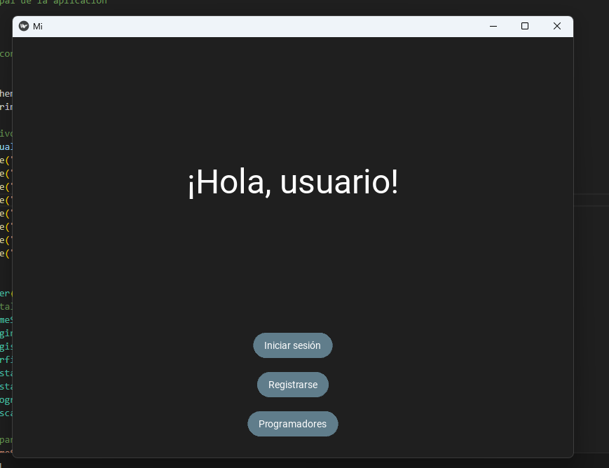
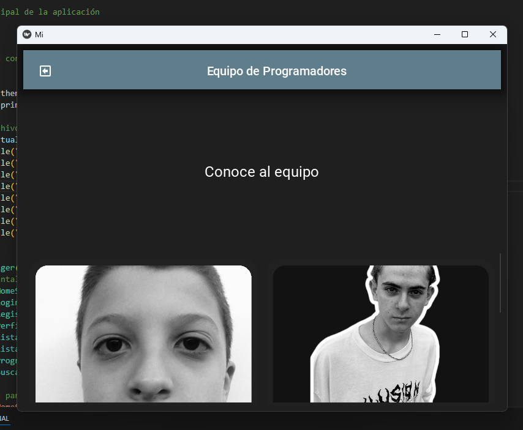
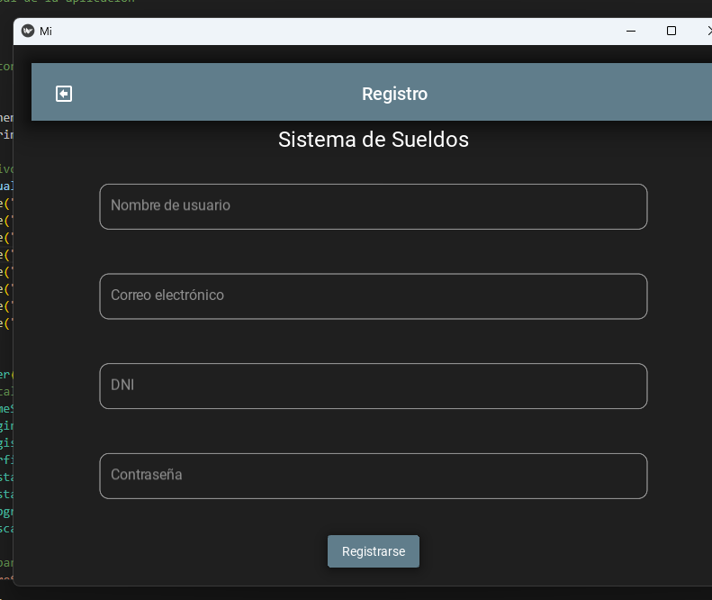
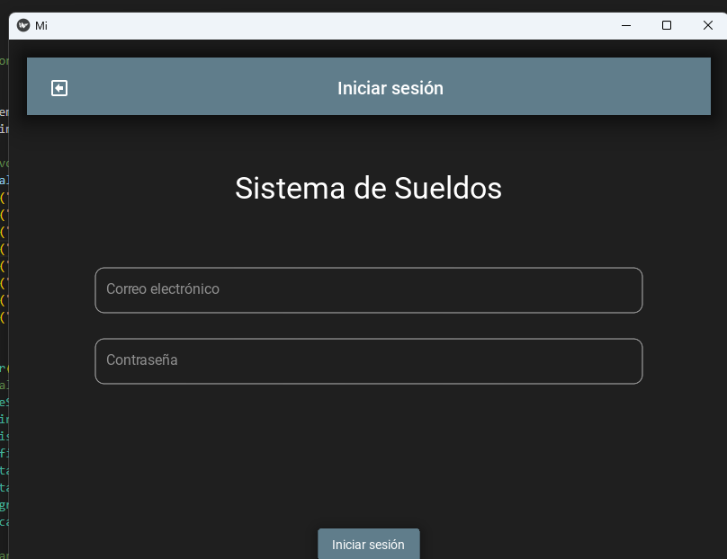
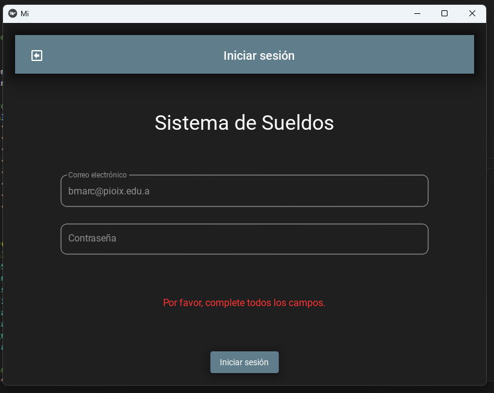
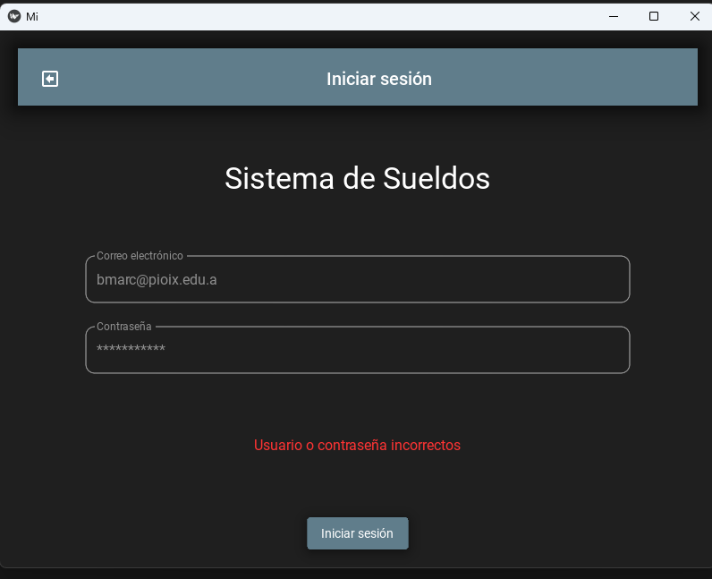
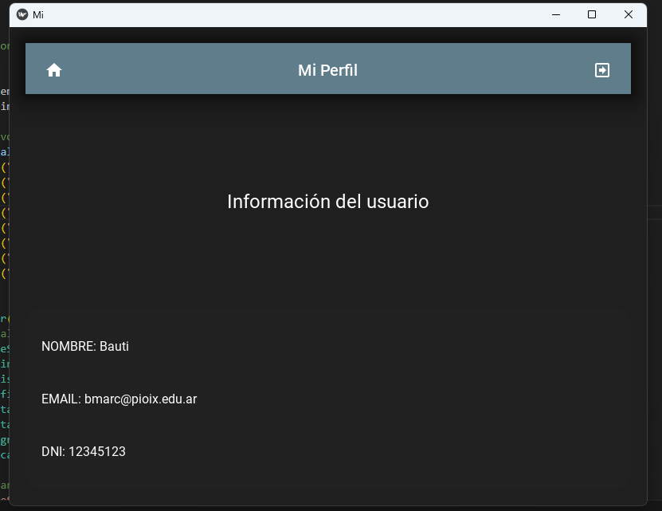
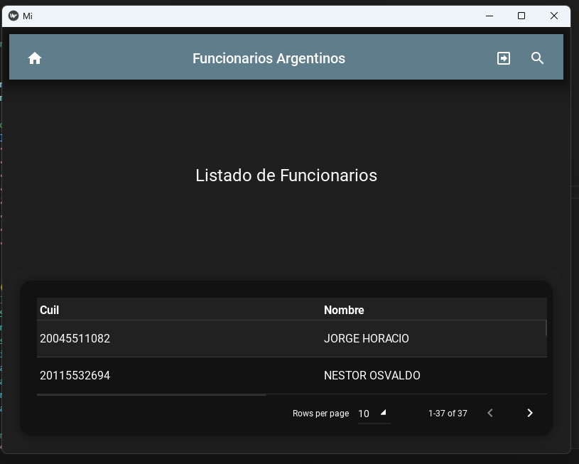
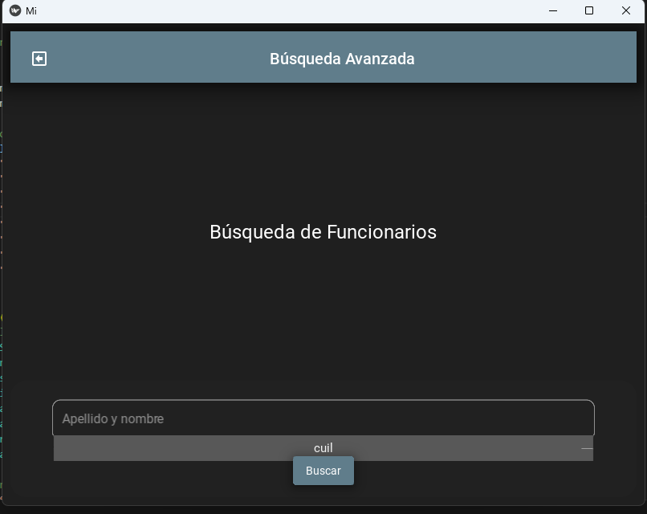

# Aplicación de Sueldos de Funcionarios
Proyecto integrador – Taller de Programación + Base de Datos

## Descripción
Sistema de escritorio desarrollado en Python con Kivy y MySQL que permite:
- Registrar e iniciar sesión de usuarios.
- Consultar, editar y eliminar registros del dataset “Sueldos de Funcionarios".

## Estructura
- `main.py` ejecuta toda la app.

## Clases principales
- `BD` conexión y consultas MySQL.
- `Usuario` manejo de usuarios y login.
- `Salarios` vincula una tabla con datos a una clase con objetos 
- `Funcionarios` vincula una tabla con datos a una clase con objetos

## Desarrollo del programa

La pantalla de inicio nos da la bienvenida y con ello 3 botones

Al presionar al de programadores nos llevara a la interfaz para ver las caras de quienes esta detrás de este gran proyecto

Cada interfaz tiene botones para retroceder y/o volver al inicio

Tiene su interfaz para registrarse lo que guardara los datos en una base de datos para poder después utilizarla para el inicio de sesion

Ya con una cuenta creada nos redigira a iniciar sesión donde con los datos que hayamos registrado anteriormente, podremos ingresar en la pagina de la app

Es obligatorio completar los campos, sino no nos dejara continuar

También cabe recalcar que si no hay una coincidencia en la base de datos con lo ingresado tampoco se podrá continuar

Luego la interfaz principal, ya iniciado sesión, donde tenemos nuestro perfil y nuestra informacion

Siempre se encuentra el logo de la casa para volver al inicio

Al moverse a la derecha tendremos las tablas con los datos conectados desde MySQL Workbench sobre los funcionarios y sus sueldos, de la ciudad de Buenos Aires el año pasado(2024)

Por ultimo tendremos para buscar cada funcionario particularmente
## Integrantes
#### 4° INF – Grupo 01
Hilario Reddel - Juan Ignacio Telmo - Santiago Kim - Bautista Marc